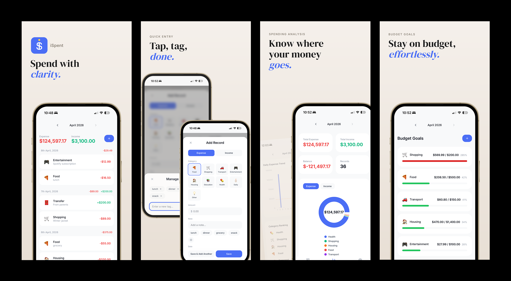

<p align="center">
  
</p>

# iSpent — Personal Expense Tracker

A modern, single-page finance tracker that turns daily bookkeeping into an effortless habit. Built for international students and young professionals who need a fast, intuitive way to log transactions and understand spending patterns at a glance.

## Problem

International students and young professionals juggle diverse spending categories (food, transport, tuition, entertainment) on a limited budget. Most existing tools are either too complex or too generic to provide quick, meaningful insights into where the money goes. iSpent offers a streamlined, no-account-needed experience to log, analyze, and budget daily finances.

## Tech Stack

| Layer | Technology | Purpose |
|-------|-----------|---------|
| Frontend | React 19 + Vite | SPA framework with fast HMR |
| Styling | Tailwind CSS | Utility-first responsive styling |
| Charts | Recharts | Donut chart, bar chart visualizations |
| Routing | React state-based | SPA page switching without page reloads |
| Backend | Node.js + Express | RESTful API server |
| Database | MongoDB + Mongoose | NoSQL document storage |

## Features

- Single-page application with seamless page transitions
- Full CRUD operations for expense/income records and budget goals
- Date-grouped transaction list with daily subtotals
- Category-based spending analysis with interactive donut chart
- Daily expense trend bar chart with average line
- Monthly budget goals with color-coded progress tracking
- Global month picker to filter all data across pages
- Responsive design — desktop sidebar, mobile bottom tab bar
- Keyboard accessible with ARIA-compliant components
- Quick note tags per category for faster expense logging, with a Manage Quick Notes modal to add or remove custom tags (persisted in localStorage)
- Toast notifications for all user actions
- Input validation on both client and server side

## App Flow

<p align="center">
  
</p>

## Getting Started

### Prerequisites

- Node.js (v18+)
- MongoDB (local or Atlas)

### Backend

```bash
cd backend
npm install
```

Create a `.env` file in the `backend/` folder:

```
MONGODB_URI=mongodb://localhost:27017/ispent
PORT=3001
```

Seed sample data and start the server:

```bash
npm run seed
npm run dev
```

### Frontend

```bash
cd frontend
npm install
npm run dev
```

Open http://localhost:5173 in a browser.

### Database Export

Sample data is available at `backend/data/sample-data.json`. This file contains the same records and budgets used by `seed.js`.

## Folder Structure

```
frontend/
├── src/
│   ├── components/
│   │   ├── layout/          # Sidebar, Header, BottomTabBar
│   │   ├── bills/           # BillsPage, RecordList, RecordItem, RecordModal, QuickNoteManager
│   │   ├── analysis/        # AnalysisPage, OverviewCards, DonutChart, BarChart, CategoryRanking
│   │   ├── goals/           # GoalsPage, BudgetList, BudgetCard, BudgetModal
│   │   └── shared/          # Modal, Toast, ConfirmDialog, MonthPicker, EmptyState
│   ├── hooks/               # useRecords, useBudgets, useStats, useQuickNotes
│   ├── services/            # api.js — unified fetch wrapper
│   ├── utils/               # formatCurrency, formatDate, getGreeting
│   └── constants/           # categories, chart colors
├── index.html
└── vite.config.js

backend/
├── server.js                # Express entry, CORS, JSON parser
├── db.js                    # MongoDB connection
├── routes/
│   ├── records.js           # /api/records CRUD
│   ├── budgets.js           # /api/budgets CRUD + spent aggregation
│   └── stats.js             # /api/stats/* read-only analytics
├── models/
│   ├── Record.js            # Mongoose schema
│   └── Budget.js            # Mongoose schema with compound unique index
└── seed.js                  # Sample data for demo
```

## Challenges Overcome

- **SPA state without React Router** — Building a cohesive single-page app without a routing library required managing page state and the shared month-picker at the App level, ensuring all child pages re-fetch data whenever the selected month changes.
- **Real-time budget aggregation** — Spent amounts are not stored in the Budgets collection; they are calculated on the fly by aggregating expense records in MongoDB, which required designing an efficient aggregation pipeline that joins data across the Records and Budgets collections.
- **Three-breakpoint responsive layout** — The app switches between a mobile bottom tab bar, a tablet icon-only sidebar, and a desktop full sidebar using Tailwind CSS utility classes, which demanded careful conditional styling without CSS duplication.
- **Adaptive modal system** — The modal works as a centered overlay on desktop and a bottom sheet on mobile, while maintaining focus trapping and keyboard accessibility across both modes.
