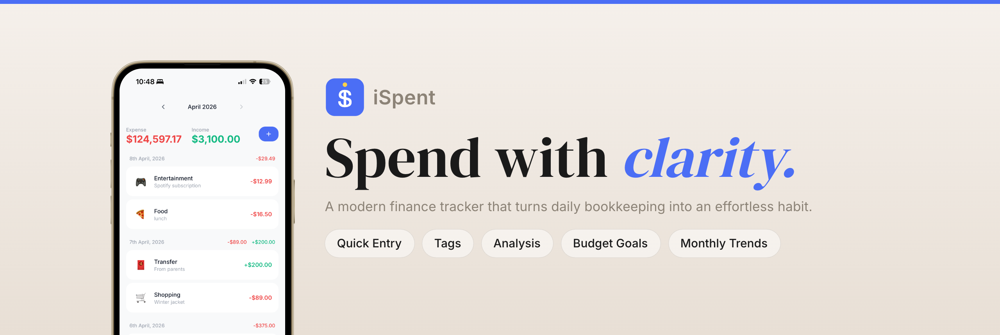
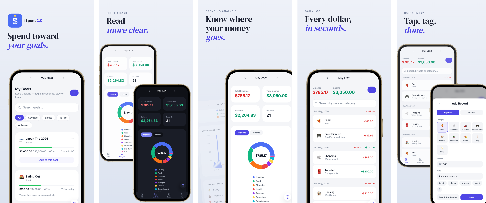
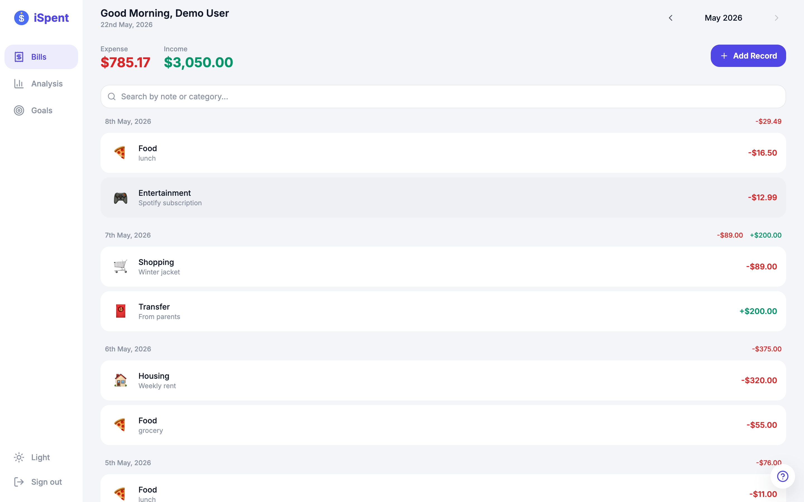
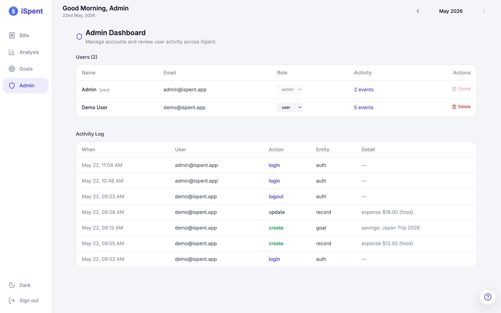
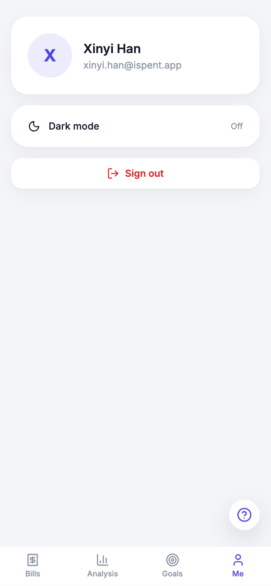
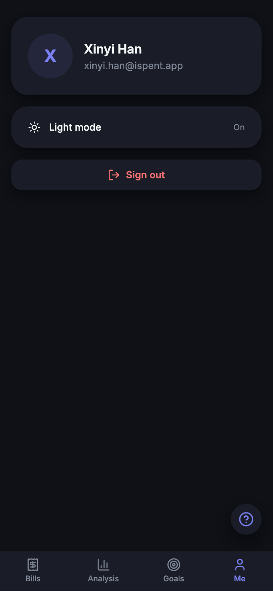
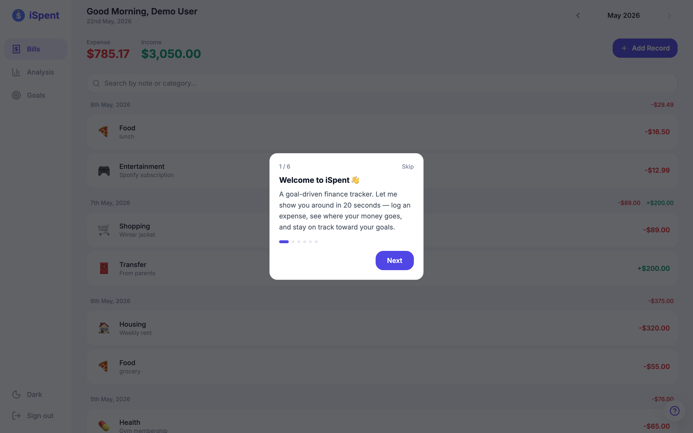
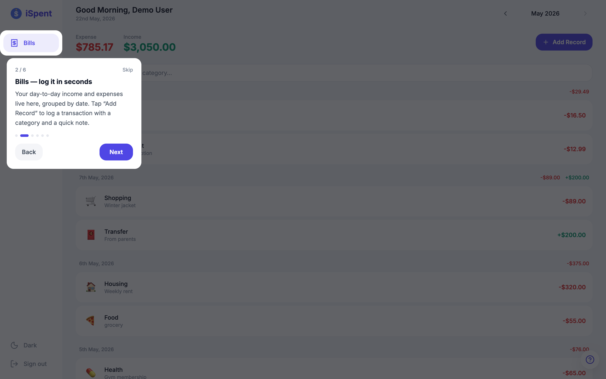

<p align="center">
  
</p>

# iSpent 2.0 — Goal-Driven Personal Finance Tracker

A modern, single-page finance tracker that turns daily bookkeeping into an effortless habit. iSpent pairs frictionless transaction logging with a goal-driven board, so every entry visibly moves the user toward a savings target, a spending limit, or a financial to-do.

> **iSpent 2.0** is a substantial evolution of the Assignment 1 expense tracker — not "A1 plus a login screen". A1 was a single-user ledger; 2.0 is a multi-user, goal-driven finance platform with authentication, role-based administration, an audit log, live search, and a themeable interface. See [From A1 to 2.0](#from-a1-to-20--what-changed) for the full delta.

<p align="center">
  
</p>

<p align="center">
  <a href="https://youtu.be/JR8B7USEm0w"><strong>▶ Watch the demo on YouTube</strong></a>
</p>

## The Problem It Solves

International students and young professionals juggle diverse spending categories (food, transport, tuition, entertainment) on a limited budget. Most tools are either too complex or too generic to give quick, meaningful insight into where the money goes — and the typical "log → look at a report" loop gives no sense of *progress*, so users stop logging after a few days.

iSpent attacks both halves of that problem:

- **Frictionless logging** — adding a transaction takes a few seconds, with per-category quick-note tags so common entries need no typing.
- **A reason to come back** — every record feeds a **Goal** card (savings / spending-limit / financial to-do), so the user always sees forward momentum, not just a static balance.

It is a multi-user web app: each account's data is fully isolated, and an **admin** role can manage all accounts and review a cross-user activity log.

## From A1 to 2.0 — What Changed

Assignment 1's iSpent was a single-user expense ledger. Version 2.0 re-architects it into a multi-user, goal-driven finance platform. The change is structural, not cosmetic:

| Aspect | A1 (single-user ledger) | iSpent 2.0 (this submission) |
|--------|-------------------------|------------------------------|
| Users | None — one shared dataset | **Multi-user**: register/login, JWT, bcrypt-hashed passwords, every query scoped by `userId` (IDOR-safe) |
| Budgets | A flat monthly number per category | **Goal entity** with three card types — `savings`, `spending_limit`, `simple_todo` |
| Finding data | No search | **Live search** filtering records and goals as you type |
| Administration | — | **Admin role**: manage all accounts, change roles, cascade-delete users, review an audit log |
| Auditability | — | **`user_activity`** entity: append-only log of logins, logouts, and every CRUD action |
| Entities under CRUD | 2 | **4** (user / record / goal / user_activity) |
| Interface | Light only | **Light + dark theme**, persisted, with a responsive Me/account area |
| Design language | Ad-hoc card styling | **Systematised, youthful design language** — a tokenised radius scale (16 / 24 / 32 px), a "round everything, no sharp corners" rule, emoji category icons, and generous whitespace, applied consistently across both themes |

> The product thesis also matured: A1 answered *"how much did I spend?"*; 2.0 answers *"am I moving toward what I set out to do?"* — the goal board turns logging from a chore into visible progress.

The headline 2.0 additions, in pictures:

**🎨 A refreshed, youthful design language** — 2.0 replaces A1's ad-hoc card styling with a deliberate visual system: large, soft corners everywhere (a tokenised 16 / 24 / 32 px radius scale, *"no sharp corners"*), emoji-led category icons, borderless depth, and generous whitespace — turning a traditionally heavy financial task into something light and approachable, while the same language carries cleanly into dark mode.

<p align="center">
  
</p>

**🛡️ Admin dashboard & audit log** — a role-gated dashboard (server-enforced via `requireAdmin`) to manage every account and review a cross-user activity feed drawn from the new `user_activity` entity.

<p align="center">
  
</p>

**🌙 Light + dark theme** — one tap re-skins the whole app via semantic CSS variables; the choice is persisted and applied before first paint (no flash).

<p align="center">
  
  &nbsp;&nbsp;
  
</p>

**🧭 Guided onboarding** — a first-run spotlight walkthrough introduces the app in six steps, reopenable anytime from the "?" help button.

<p align="center">
  
  &nbsp;&nbsp;
  
</p>

> See **[SCREENSHOTS.md](SCREENSHOTS.md)** for the full responsive gallery (every view on desktop and mobile).

## Tech Stack

| Layer | Technology | Purpose |
|-------|-----------|---------|
| Frontend | React 19 + Vite | SPA framework with fast HMR |
| Styling | Tailwind CSS | Utility-first responsive styling |
| Charts | Recharts | Donut chart and bar chart visualizations |
| Routing | React state-based | SPA page switching without page reloads |
| Auth | JWT + bcryptjs | Stateless token auth, hashed passwords |
| Backend | Node.js + Express | RESTful API server |
| Database | MongoDB + Mongoose | NoSQL document storage |

## Core Entities (CRUD)

iSpent applies full Create / Read / Update / Delete operations across **four** conceptual entities:

| Entity | Description | Access |
|--------|-------------|--------|
| **user** | Account with `user` / `admin` role | Self (register/login); admin manages all |
| **record** | An income or expense transaction | Owner only, scoped by `userId` |
| **goal** | A savings target, spending limit, or financial to-do card | Owner only |
| **user_activity** | Append-only audit log of logins, logouts, and CRUD actions | Admin read-only |

## Key Features

- **Authentication** — email-first register / login, passwords hashed with bcrypt, stateless JWT (7-day expiry), automatic logout on token expiry.
- **Per-user data isolation** — every record / goal / budget query is scoped by `userId`; a user can never read or mutate another user's data (guards against IDOR).
- **Admin dashboard** — admins get an extra tab to list all accounts, promote/demote roles, delete a user (cascade-deletes their data), and review an activity log filterable by user.
- **Live search** — the Bills and Goals pages filter results in real time as the user types, entirely client-side for instant feedback.
- **Full CRUD** — records (income/expense) and goals (three card types) with create / edit / delete flows and confirmation dialogs.
- **Analysis** — category donut chart, daily expense-trend bar chart with an average line, monthly overview cards.
- **SPA experience** — one `index.html`; pages swap via React state, no full reloads; a global month picker re-fetches the active page's data.
- **Responsive** — desktop sidebar, tablet icon rail, mobile bottom tab bar, accessible (ARIA, keyboard, focus management).
- **Robust error handling** — a single fetch wrapper surfaces every API/network failure as a toast; the UI never shows a blank screen on error; input validated on both client and server.

## Getting Started

### Prerequisites

- Node.js (v18+)
- MongoDB (local or Atlas)

### Backend

```bash
cd backend
npm install
```

Create the `.env` file by copying the provided template, then fill in the values:

```bash
cp .env.example .env
```

```
MONGODB_URI=mongodb://localhost:27017/ispent-a2
JWT_SECRET=replace-with-a-long-random-string
PORT=3001
```

> No third-party API keys are needed — iSpent is fully self-hosted (local password hashing + JWT + local MongoDB). `JWT_SECRET` is any long random string you choose, e.g. `openssl rand -hex 32`.

Seed sample data (creates demo + admin accounts) and start the server:

```bash
npm run seed
npm run dev
```

### Frontend

```bash
cd frontend
npm install
npm run dev
```

Open <http://localhost:5173> in a browser.

### Demo Accounts

`npm run seed` creates two ready-to-use accounts:

| Role | Email | Password |
|------|-------|----------|
| User | `demo@ispent.app` | `demo1234` |
| Admin | `admin@ispent.app` | `admin1234` |

Log in as the admin to see the **Admin** tab (user management + activity log).

### Database Export

A database export is provided at `backend/data/sample-data.json` — the same records, budgets, goals, and seed activity used by `seed.js`.

## Folder Structure

```
ispent-a2/
├── frontend/                  # React + Vite single-page app
│   ├── src/
│   │   ├── components/
│   │   │   ├── layout/        # Sidebar, Header, BottomTabBar (role-aware nav)
│   │   │   ├── auth/          # AuthPage — email-first login / register
│   │   │   ├── bills/         # BillsPage, RecordList/Item/Modal, QuickNoteManager
│   │   │   ├── analysis/      # AnalysisPage, OverviewCards, DonutChart, BarChart, CategoryRanking
│   │   │   ├── goals/         # GoalsPage, GoalCard/FormModal, BudgetCard/List/Modal
│   │   │   ├── admin/         # AdminPage — user management + activity log
│   │   │   └── shared/        # Modal, Toast, ConfirmDialog, MonthPicker, EmptyState
│   │   ├── hooks/             # useAuth, useAdmin, useRecords, useBudgets, useGoals, useStats, useQuickNotes
│   │   ├── services/          # api.js — unified fetch wrapper + 401 handling
│   │   ├── utils/             # currency/date helpers
│   │   └── constants/         # categories, chart colors
│   ├── index.html
│   └── vite.config.js
│
├── backend/                   # Express + MongoDB REST API
│   ├── server.js              # App entry, CORS, route mounting, auth gating
│   ├── db.js                  # MongoDB (Mongoose) connection
│   ├── middleware/
│   │   └── auth.js            # requireAuth (JWT verify) + requireAdmin (role gate)
│   ├── routes/
│   │   ├── auth.js            # register / login / logout / me
│   │   ├── records.js         # /api/records CRUD
│   │   ├── budgets.js         # /api/budgets CRUD + spent aggregation
│   │   ├── goals.js           # /api/goals CRUD (three goal types)
│   │   ├── stats.js           # /api/stats/* read-only analytics
│   │   └── admin.js           # /api/admin/* — users + activity (admin only)
│   ├── models/
│   │   ├── User.js            # Account schema (role: user | admin)
│   │   ├── Record.js          # Transaction schema (scoped by userId)
│   │   ├── Budget.js          # Budget schema, compound unique index
│   │   ├── Goal.js            # Goal schema — savings / spending_limit / simple_todo
│   │   └── UserActivity.js    # Audit-log schema + logActivity() helper
│   ├── data/
│   │   └── sample-data.json   # Database export
│   └── seed.js                # Seeds demo + admin accounts and sample data
│
├── feature-spec.md            # Full CRUD flows, endpoints, data models
├── design-system.md           # Visual design specification
└── README.md
```

## Security Notes

- Passwords are hashed with bcrypt (cost 10); plaintext is never stored or returned.
- JWT is signed with a server-side secret read from `.env` (not committed; `.env` is git-ignored).
- Every business route runs behind `requireAuth`; admin routes additionally run behind `requireAdmin`. The frontend hiding the Admin tab for non-admins is a UX nicety only — access is enforced server-side.
- An admin cannot delete or demote their own account, preventing the system from being locked out of all admin access.

## Workload Allocation

**This is an individual submission. Xinyi Han is the only student working on this project** — all source code, design, documentation, and the demo recording were produced solely by Xinyi Han, with no other contributors. The group component is therefore assessed as an individual component per the assignment specification.

Authorship is traceable through the Git commit history (incremental, meaningfully-messaged commits throughout — not a single bulk upload) and via `/* Author: Xinyi */` header comments on the entity files.

| Area | Author |
|------|--------|
| Project scaffold (React + Vite + Express + MongoDB) | Xinyi Han |
| Auth (JWT, bcrypt, email-first flow, per-user isolation) | Xinyi Han |
| Records / Budgets / Goals entities + CRUD (front & back) | Xinyi Han |
| `user_activity` entity + admin dashboard | Xinyi Han |
| Analysis charts, responsive layout, shared components | Xinyi Han |
| README, feature spec, design system, demo recording | Xinyi Han |

## Notes on Technical Choices

- **SPA without React Router** — page state and the shared month picker live at the `App` level; child pages re-fetch when the month changes. Kept the dependency surface small for a project this size.
- **`useState` vs `useRef`** — form fields use `useState` (need re-render); the amount input's auto-focus uses `useRef` (DOM access without re-render).
- **Real-time aggregation, not stored totals** — budget `spent` and spending-limit progress are computed on read via a MongoDB aggregation pipeline over the user's records, so they can never drift out of sync with the underlying transactions.
- **Audit log as its own collection** — `user_activity` is append-only and high-volume, so it is a separate collection rather than an array on `User`, keeping user reads cheap and the admin view paginatable. Logging is fire-and-forget: an audit-write failure can never turn a successful CRUD operation into an error.
