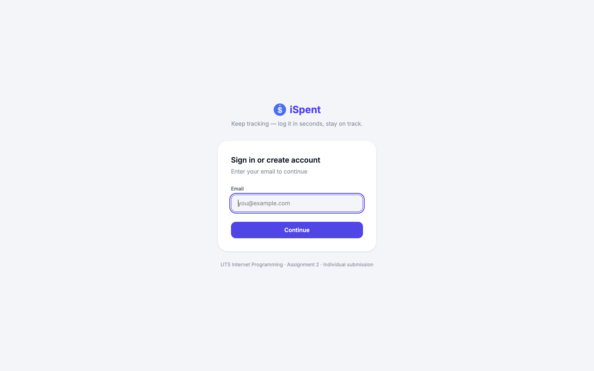

# iSpent — Screenshots

This gallery has two parts:

1. **[What's New in 2.0](#-whats-new-in-20)** — the upgrades that turn the
   single-user Assignment 1 tracker into a multi-user 2.0 product.
2. **[Feature gallery](#feature-gallery)** — every view shown on desktop (left)
   and mobile (right), demonstrating the responsive layout: the desktop sidebar
   collapses to a bottom tab bar on mobile.

---

## 🆕 What's New in 2.0

iSpent 1.0 was a single-user expense tracker. iSpent 2.0 keeps that core loop
and rebuilds the product around **accounts, access control, and polish**. Each
upgrade below is framed the same way — *what A1 lacked → what 2.0 does → the
proof.*

### 🔐 Accounts & roles

> **A1:** One shared, single-user app. No sign-in — anyone who opened it saw the
> same data.
>
> **2.0:** Every user has their own account behind a stateless **JWT login**
> (bcrypt-hashed passwords, HS256 tokens). Each request is scoped to its owner,
> so users can only ever see and edit their own records — authorization is
> enforced server-side, not just hidden in the UI.

<table>
  <tr>
    <td valign="top" width="50%"></td>
    <td valign="top" width="50%"></td>
  </tr>
</table>

### 🛡️ Admin dashboard & audit log

> **A1:** No notion of an administrator and no record of who did what.
>
> **2.0:** A **role-based admin dashboard** (visible only to `admin` users; the
> server re-checks the role on every request via `requireAdmin`). Admins can
> review every account, change roles, and delete users — with self-protection
> guards so an admin can never lock themselves out. Every login, logout, and
> create/update/delete is captured in a fourth entity, **`user_activity`**, and
> surfaced as a cross-user audit log.

### 🌙 Dark mode

> **A1:** Light theme only.
>
> **2.0:** A full **light/dark theme** built on semantic CSS variables — one
> tap re-skins the entire app (surfaces, text, icons, and accent colours all
> cascade from `--c-*` tokens). The choice is remembered, and a render-blocking
> script applies it before first paint, so there is no flash of the wrong theme.

<table>
  <tr>
    <td valign="top" width="50%"></td>
    <td valign="top" width="50%"></td>
  </tr>
</table>

### 🧭 Guided onboarding

> **A1:** Users were dropped straight into an empty app with no guidance.
>
> **2.0:** A first-run **spotlight walkthrough** introduces the three areas and
> dark mode in six steps, then never auto-opens again. It can be reopened
> anytime from the "?" help button.

<table>
  <tr>
    <td valign="top" width="50%"></td>
    <td valign="top" width="50%"></td>
  </tr>
</table>

### At a glance

| Capability | iSpent 1.0 | iSpent 2.0 |
|---|---|---|
| Accounts | None — single shared app | Per-user JWT login (bcrypt + HS256) |
| Access control | None | `requireAuth` + `requireAdmin`, role-based |
| Admin tools | None | User management + role changes + delete |
| Audit trail | None | `user_activity` log (4th CRUD entity) |
| Theme | Light only | Light **and** dark, token-based |
| First-run UX | Empty app | 6-step guided spotlight tour |

---

## Feature gallery

### Bills (Home)

Every income and expense, grouped by day, with the month's totals at the top
and a live search box. A global month picker scopes the whole app.

<table>
  <tr>
    <td valign="top" width="65%"></td>
    <td valign="top" width="35%"></td>
  </tr>
</table>

### Add Record

Log a transaction in seconds: pick a type and category, enter an amount, and
add a note — with per-category quick-note tags so common entries need no typing.

<table>
  <tr>
    <td valign="top" width="65%"></td>
    <td valign="top" width="35%"></td>
  </tr>
</table>

### Goals

The heart of iSpent 2.0. Goals come in three card types:

- **Savings** — a target amount with a funded-progress bar and a deadline (e.g. *Japan Trip*, 60% funded).
- **Spending limit** — automatically tracks a category's spend for the current period against a cap (e.g. *Eating Out*, $158.50 / $400).
- **Simple to-do** — a financial task to check off (e.g. *Research one ETF*).

Every record you log moves the matching goal forward automatically. Filter pills
(All / Savings / Limits / To-do / Achieved) and live search narrow the board.

<table>
  <tr>
    <td valign="top" width="65%"></td>
    <td valign="top" width="35%"></td>
  </tr>
</table>

### Analysis

A visual breakdown of spending: a category donut, a daily-spend trend with an
average line, and a category ranking — all computed live from your records.

<table>
  <tr>
    <td valign="top" width="65%"></td>
    <td valign="top" width="35%"></td>
  </tr>
</table>

### Admin dashboard

Visible only to admins. The **Users** table manages every account (change role,
delete, with self-protection guards), and the **Activity Log** shows a
cross-user feed of logins and CRUD actions drawn from the `user_activity` entity.

### Guided onboarding tour

On first login, a spotlight walkthrough introduces the three areas and dark
mode; it can be reopened anytime from the "?" help button.

<table>
  <tr>
    <td valign="top" width="50%"></td>
    <td valign="top" width="50%"></td>
  </tr>
</table>
