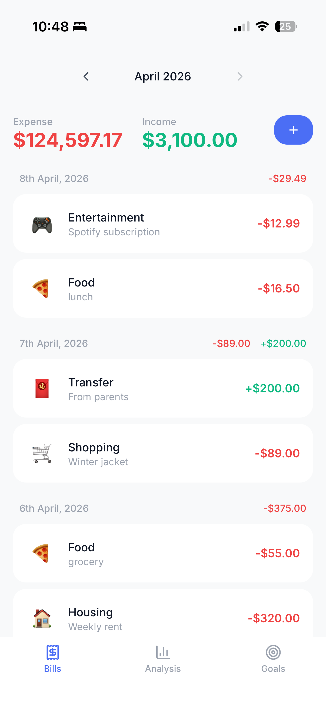
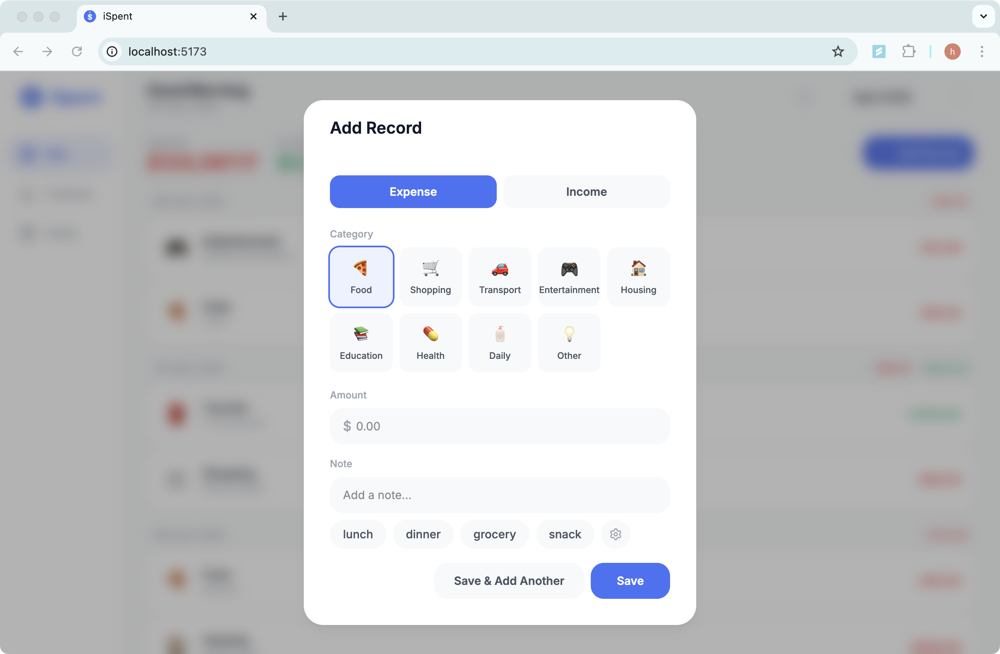
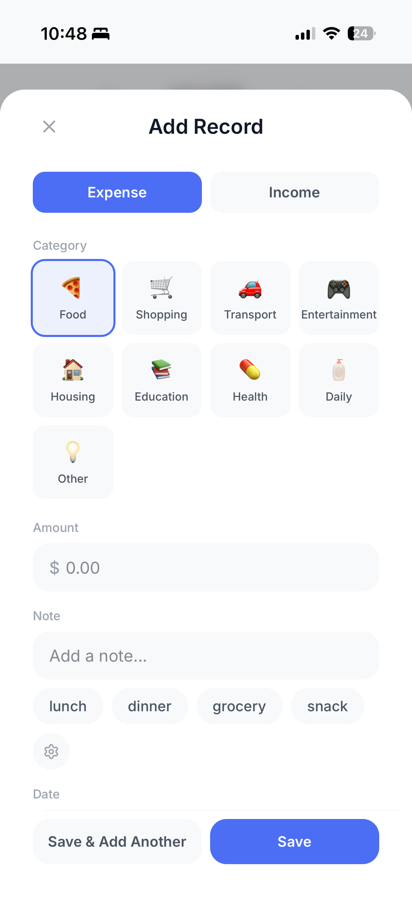
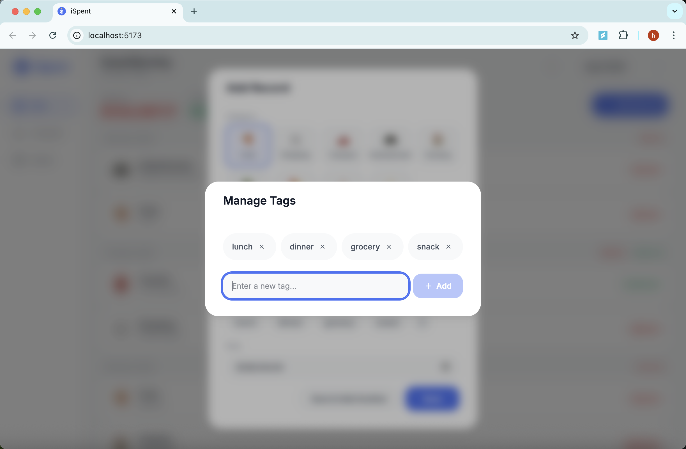
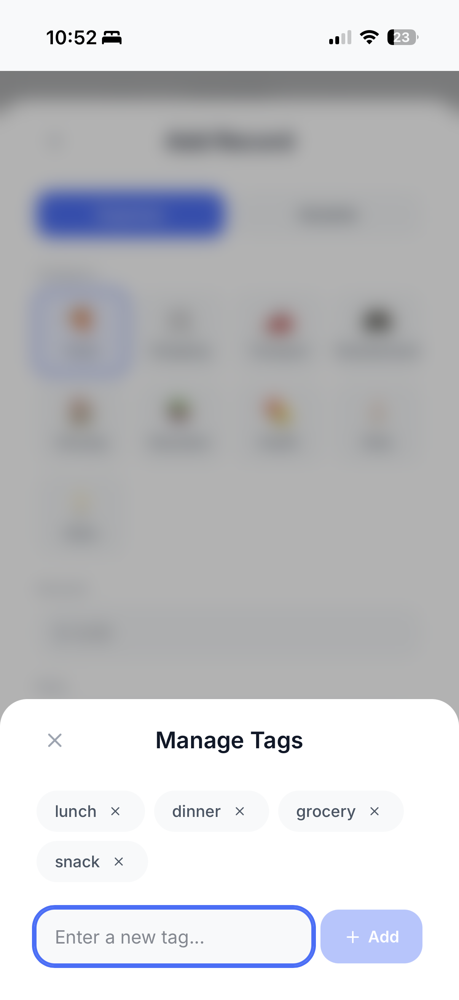
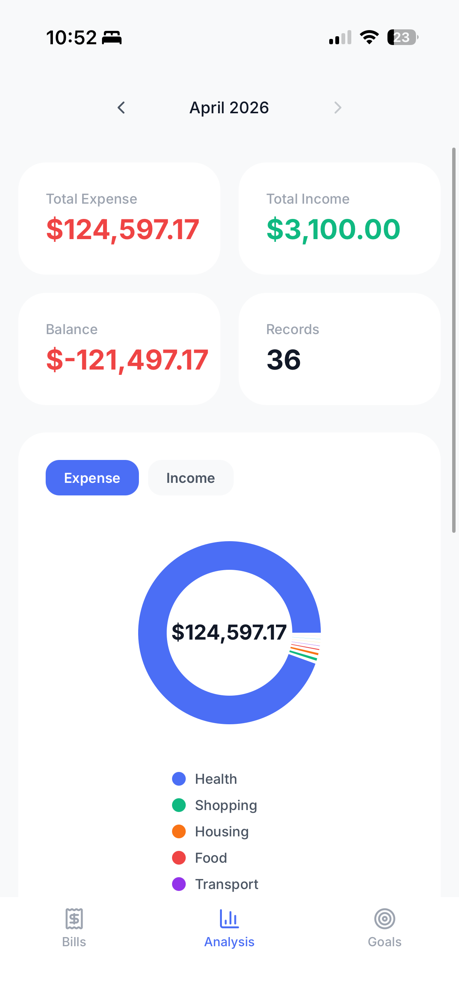
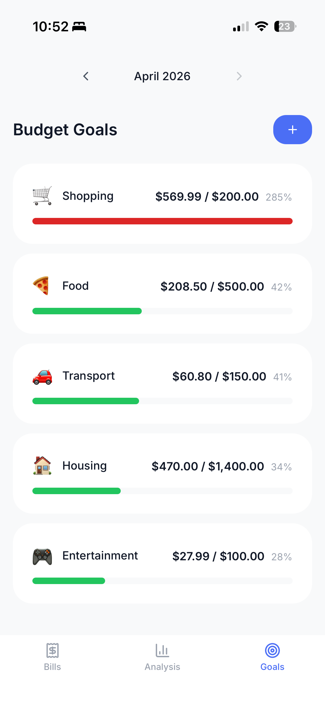
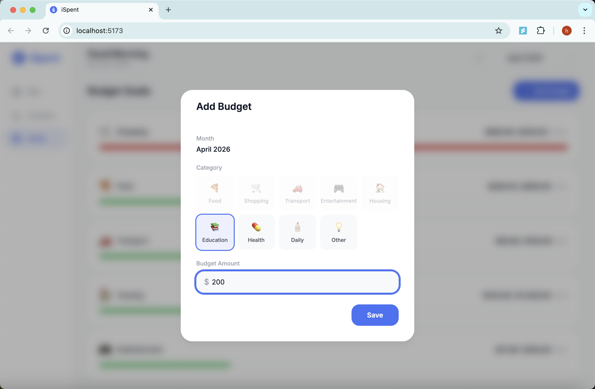
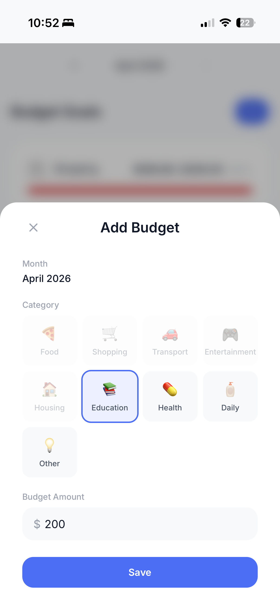

# iSpent - Screenshots

## Bills (Home Page)
View all expense and income records grouped by date, with monthly totals.

<table>
  <tr>
    <td valign="top" width="65%"></td>
    <td valign="top" width="35%"></td>
  </tr>
</table>

## Add Record (Quick Notes)
Add a new expense or income record with category, amount, and quick note tags for faster entry.

<table>
  <tr>
    <td valign="top" width="65%"></td>
    <td valign="top" width="35%"></td>
  </tr>
</table>

Manage tags — add or remove tags to customize your recording workflow.

<table>
  <tr>
    <td valign="top" width="65%"></td>
    <td valign="top" width="35%"></td>
  </tr>
</table>

## Analysis
Visual breakdown of spending with category pie chart and daily trend.

<table>
  <tr>
    <td valign="top" width="65%"></td>
    <td valign="top" width="35%"></td>
  </tr>
</table>

## Budget Goals
Track monthly spending against budget goals by category.

<table>
  <tr>
    <td valign="top" width="65%"></td>
    <td valign="top" width="35%"></td>
  </tr>
</table>

Set a budget for any category with a monthly amount.

<table>
  <tr>
    <td valign="top" width="65%"></td>
    <td valign="top" width="35%"></td>
  </tr>
</table>
