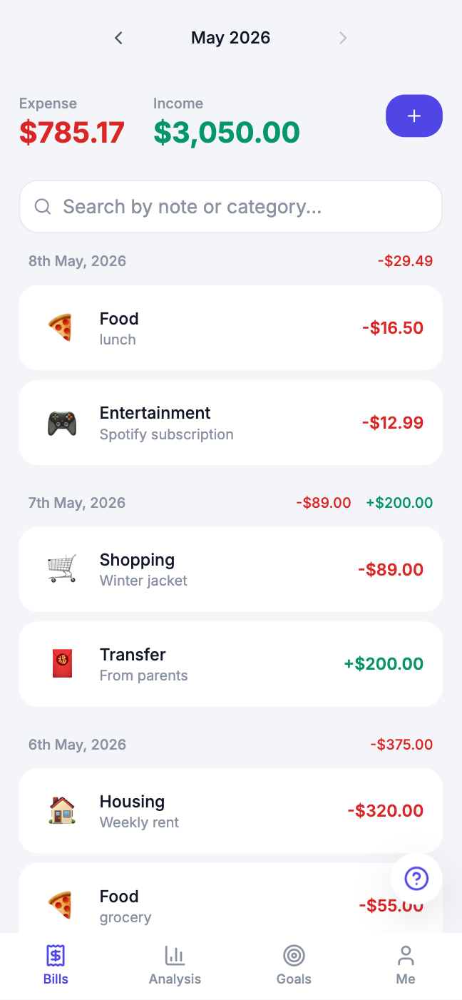
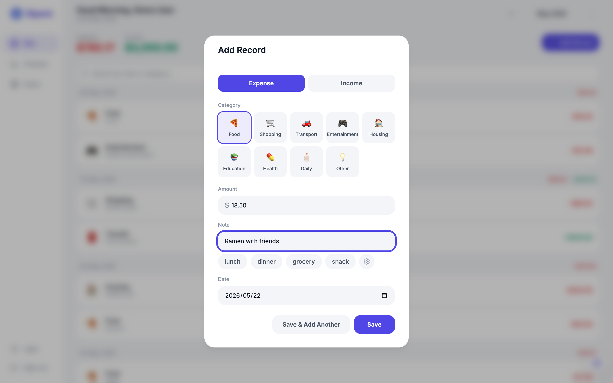
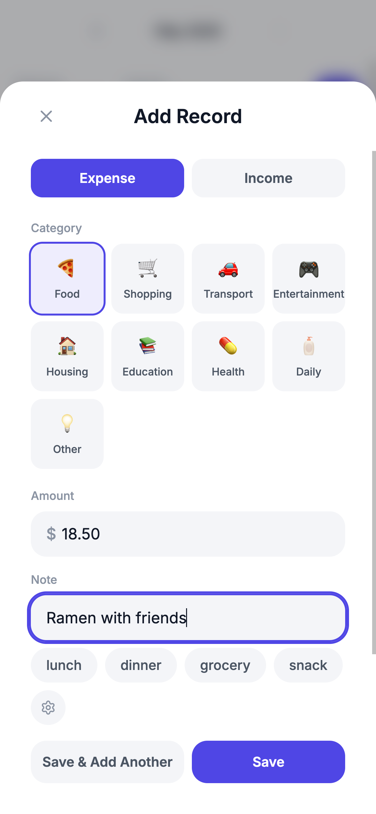
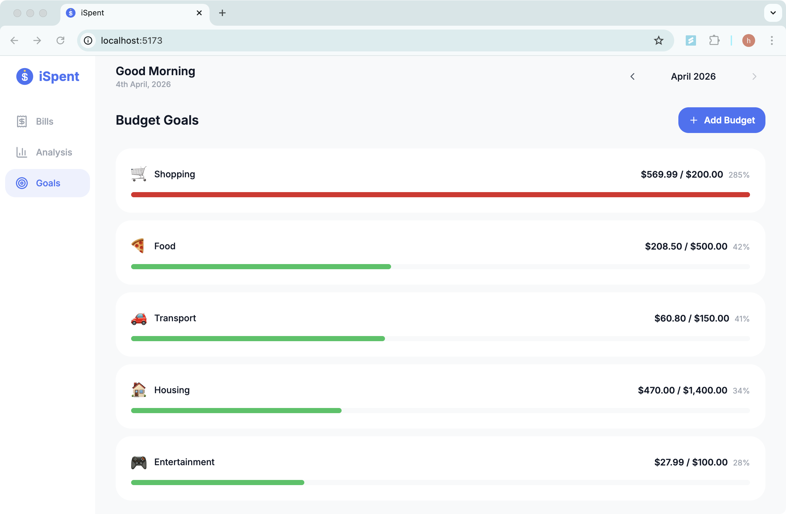
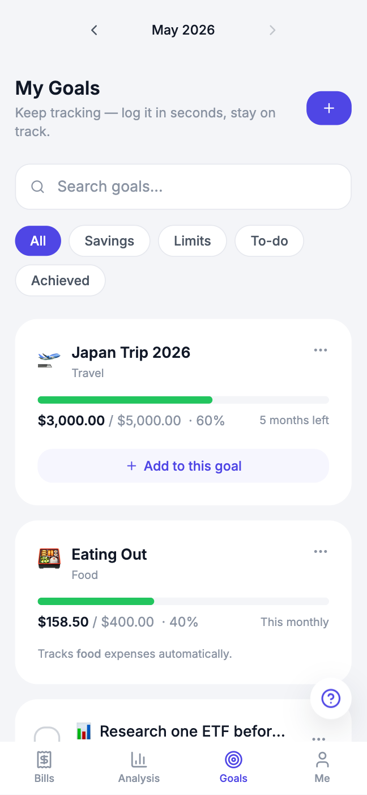
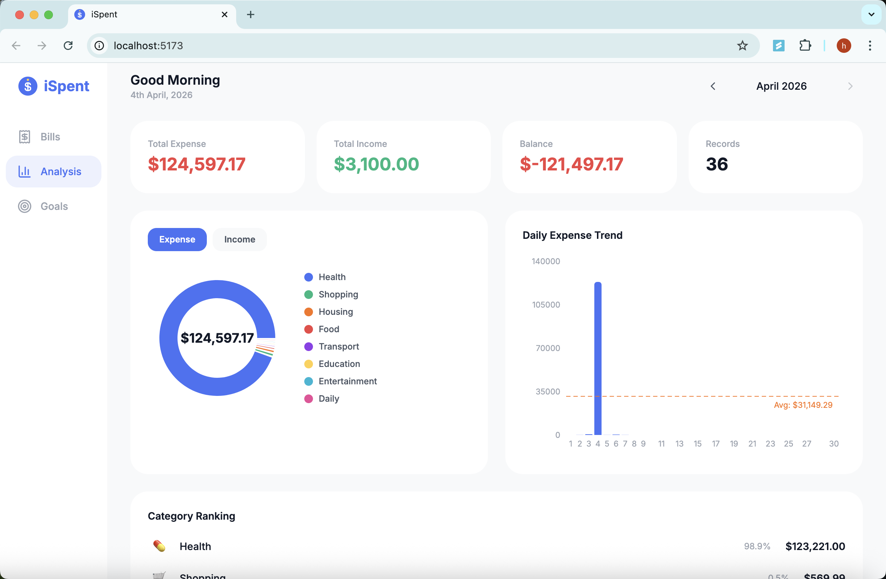
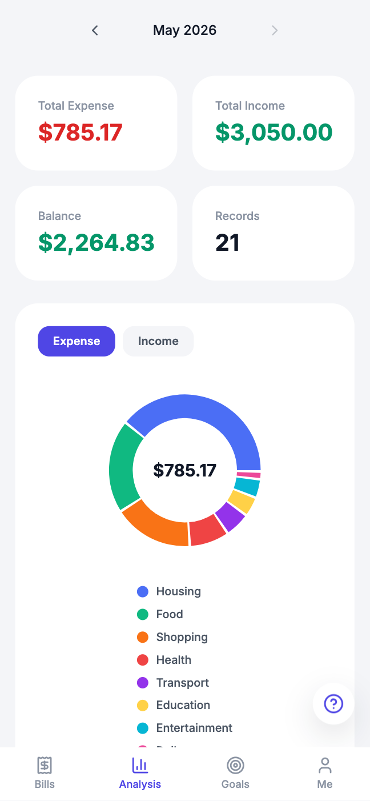

# iSpent 2.0 — Screenshots

Each view is shown on desktop (left) and mobile (right) to demonstrate the
responsive layout: the desktop sidebar collapses to a bottom tab bar on mobile.

## Bills (Home)

Every income and expense, grouped by day, with the month's totals at the top and a live search box. A global month picker scopes the whole app.

<table>
  <tr>
    <td valign="top" width="65%"></td>
    <td valign="top" width="35%" align="center"></td>
  </tr>
</table>

## Add Record

Log a transaction in seconds: pick a type and category, enter an amount, and add a note — with per-category quick-note tags so common entries need no typing.

<table>
  <tr>
    <td valign="top" width="65%"></td>
    <td valign="top" width="35%" align="center"></td>
  </tr>
</table>

## Goals

Three goal card types — **savings** (target + progress bar + deadline), **spending limit** (auto-tracks a category's spend against a cap), and **simple to-do** (a financial task to check off). Every record you log moves the matching goal forward automatically; filter pills and live search narrow the board.

<table>
  <tr>
    <td valign="top" width="65%"></td>
    <td valign="top" width="35%" align="center"></td>
  </tr>
</table>

## Analysis

A visual breakdown of spending: a category donut, a daily-spend trend with an average line, and a category ranking — all computed live from your records.

<table>
  <tr>
    <td valign="top" width="65%"></td>
    <td valign="top" width="35%" align="center"></td>
  </tr>
</table>

## Admin Dashboard

Visible only to admins. The **Users** table manages every account (change role, delete, with self-protection guards), and the **Activity Log** shows a cross-user feed of logins and CRUD actions drawn from the `user_activity` entity.

<table>
  <tr>
    <td valign="top" width="65%"></td>
    <td valign="top" width="35%" align="center"></td>
  </tr>
</table>

## Dark Mode

A full light/dark theme built on semantic CSS variables — one tap re-skins the entire app, and the choice is remembered across sessions.

<table>
  <tr>
    <td valign="top" width="50%" align="center"></td>
    <td valign="top" width="50%" align="center"></td>
  </tr>
</table>

## Guided Onboarding Tour

On first login, a spotlight walkthrough introduces the three areas and dark mode; it can be reopened anytime from the "?" help button.

<table>
  <tr>
    <td valign="top" width="50%"></td>
    <td valign="top" width="50%"></td>
  </tr>
</table>
